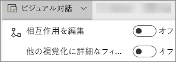

# Power BI レポートでの視覚化の相互作用
レポートの編集アクセス許可が与えられている場合、**[ビジュアル対話]** を使い、レポート ページの視覚エフェクトの相互作用を変更できます。 

既定では、レポート ページ上の 1 つの視覚化を使って、そのページ上の他の視覚化に処理とクロス強調表示を適用できます。
たとえば、マップの視覚化で州を選択した時に、その州の縦棒グラフを強調表示し、その 1 つの州に当てはまるデータのみを表示するように折れ線グラフをフィルター処理できます。
「[フィルター処理と強調表示について](power-bi-reports-filters-and-highlighting.md)」を参照してください。 また、視覚エフェクトが[詳細表示](power-bi-visualization-drill-down.md)に対応している場合、既定では、ある視覚エフェクトに詳細表示を適用してもレポート ページの他の視覚エフェクトは変更されません。 ただし、このような既定の動作はいずれもオーバーライドできます。また、相互作用は視覚エフェクトごとに設定できます。

この記事では、Power BI サービスの[編集ビュー](service-interact-with-a-report-in-editing-view.md)と Power BI Desktop で**ビジュアル対話**を使用する方法について説明します。 他のユーザーとレポートを共有している場合、ビジュアル対話設定は変更できません。

> [!NOTE]
> *クロスフィルター処理* と *クロス強調表示* という用語は、ここで説明する動作を、**[フィルター]** ウィンドウを使って視覚化のフィルター処理と強調表示を行う場合の動作と区別するために使っています。  
> 
> 

<iframe width="560" height="315" src="https://www.youtube.com/embed/N_xYsCbyHPw?list=PL1N57mwBHtN0JFoKSR0n-tBkUJHeMP2cP" frameborder="0" allowfullscreen></iframe>

1. 視覚化を選んでアクティブにします。  
2. **[ビジュアル対話]** オプションを表示します。
    - Power BI サービスで、レポートのメニュー バーからドロップダウンを選びます。

       

    - デスクトップで、**[書式]、[相互作用]** の順に選びます。

        

3. 視覚エフェクトの相互作用コントロールをオンにするには、**[相互作用を編集]** を選びます。 Power BI で、レポート ページのその他すべての視覚エフェクトにクロス フィルター アイコンとクロス強調表示アイコンが追加されます。
   
    
3. 選択した視覚化が他の視覚化に与える影響を決めます。  また、必要に応じて、レポート ページの他のすべての視覚エフェクトに対して繰り返します。
   
   * 視覚エフェクトにクロスフィルターを適用する場合は、**[フィルター]** アイコン  を選びます。
   * 視覚エフェクトにクロス強調表示を適用する場合は、**[強調表示]** アイコン  を選びます。
   * 影響を受けないようにする場合は、**[影響なし]** アイコン  を選びます。

4. 詳細表示コントロールをオンにするには、**[他の視覚化に詳細なフィルターを適用する]** を選びます。  視覚化でドリルダウン (およびドリルアップ) すると、レポート ページの他の視覚エフェクトで現在の詳細表示選択が反映されます。 

   

### 次の手順
[レポート フィルターの使用方法](power-bi-how-to-report-filter.md)

[レポート内のフィルターと強調表示](power-bi-reports-filters-and-highlighting.md)

[Power BI - 基本的な概念](service-basic-concepts.md)

他にわからないことがある場合は、 [Power BI コミュニティを利用してください](http://community.powerbi.com/)。

