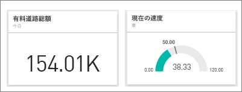
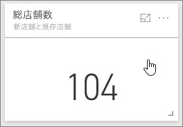
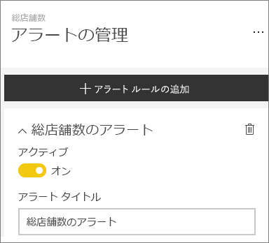
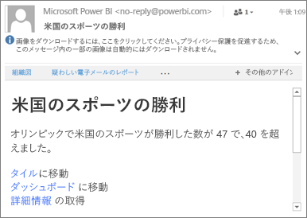
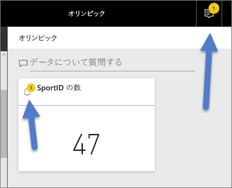
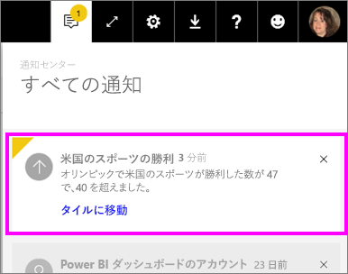
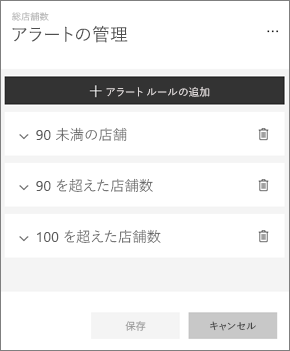
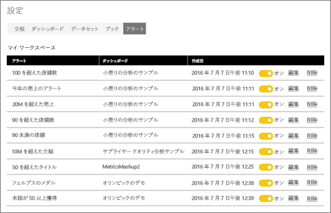

# Power BI サービスでのデータ アラート
アラートを設定すると、ダッシュボード内のデータが設定した制限を超えて変更された場合に通知されます。 アラートは、レポートのビジュアルからピン留めされたタイルでのみ、ゲージ、KPI、カードに対してだけ設定できます。 アラートは、レポートからダッシュボードにピン留めしたストリーミング データセットから作成されるビジュアルに設定できますが、**[タイルの追加]** > **[カスタム ストリーミング データ]** でダッシュボードで直接作成したストリーミング タイルには設定できません。 ダッシュボードを共有している場合であっても、見ることができるのは自分で設定したアラートだけです。 データ アラートはプラットフォーム間で完全に同期されます。[Power BI モバイル アプリ](mobile-set-data-alerts-in-the-mobile-apps.md)および Power BI サービスで、データ アラートを設定して表示できます。 これらを Power BI Desktop で使用することはできません。 アラートを[自動化し、Microsoft Flow と統合することもできます。](https://flow.microsoft.com) - [お試しください](service-flow-integration.md)。

> [!WARNING]
> データ ドリブン アラート通知は、データに関する情報を提供します。 モバイル デバイスで Power BI データを表示し、そのデバイスが盗まれた場合、Power BI サービスを使用して、すべてのデータ ドリブン アラート ルールをオフにすることをお勧めします。
> 
> 

## Power BI サービスでのデータ アラートの設定
Amanda がダッシュボードのタイルにアラートを追加するところをご覧ください。 その後、ビデオで説明されている手順に従って、ご自分でやってみてください。

<iframe width="560" height="315" src="https://www.youtube.com/embed/JbL2-HJ8clE" frameborder="0" allowfullscreen></iframe>

この例では、Retail Analysis サンプル ダッシュボードのカード タイルを使用します。

1. ダッシュボードで開始します。 ダッシュボードのゲージ、KPI、またはカード タイルで、省略記号を選びます。
   
   
2. ベルのアイコン  を選択して、**[Total stores]** に 1 つまたは複数のアラートを追加します。
   
   
3. 最初に、スライダーが **[オン]** に設定されていることを確認し、アラートのタイトルを指定します。 タイトルは、アラートの内容を簡単に理解するために役立ちます。
   
   
4. 下にスクロールして、アラートの詳細を入力します。  この例では、"Total stores" の値が 100 を超えた場合に 1 日に 1 回通知するアラートを作成します。 アラートは通知センターに表示されます。 電子メールの送信も設定します。
   
   
5. **[保存]**を選択します。

## アラートの受信
追跡対象データがユーザー設定のしきい値のいずれかに達した場合は、いくつかの処理が行われます。 最初に、最後のアラートが送信されてから 1 時間以上または 24 時間以上 (選択したオプションによって異なる) 経過しているかどうかが確認されます。 データがしきい値を超えている場合に限り、アラートを受け取ります。

次に、通知センターにアラートが送信され、さらにオプションで電子メールでもアラートが送信されます。 各アラートにはデータへの直接リンクが含まれています。 リンクを選択して関連するタイルを表示し、調査、共有、詳細の確認を行うことができます。  

1. 電子メールを送信するようにアラートを設定した場合は、次のようなメールを受信します。
   
   
2. Power BI は、メッセージを**通知センター**に追加し、新しいアラート アイコンを該当するタイルに追加します。
   
   
3. アラートの詳細を見るには通知センターを開きます。
   
    
   
   > [!NOTE]
   > アラートは更新されたデータでのみ動作します。 データが更新されると、Power BI はそのデータにアラートが設定されているかどうかを確認します。 データがアラートのしきい値に達した場合、アラートがトリガーされます。
   > 
   > 

## アラートの管理
アラートを管理するには 3 つの方法があります。ダッシュボードのタイル自体、Power BI の [設定] メニュー、そして [iPhone の Power BI モバイル アプリ](mobile-set-data-alerts-in-the-mobile-apps.md)または [Windows 10 用の Power BI モバイル アプリ](mobile-set-data-alerts-in-the-mobile-apps.md)の個別のタイルです。

### タイル自体から
1. タイルのアラートを変更または削除する必要がある場合は、ベルのアイコン  を選択して **[アラートの管理]** ウィンドウを再び開きます。 そのタイルに設定されているすべてのアラートが表示されます。
   
    
2. アラートを変更するには、アラート名の左側にある矢印を選択します。
   
    
3. アラートを削除するには、アラート名の右側にあるごみ箱を選択します。
   
      

### Power BI の [設定] メニューから
1. Power BI のメニュー バーで歯車アイコンを選択します。
   
    
2. **[設定]** の **[アラート]** を選択します。
   
    
3. ここからは、アラートをオンまたはオフにしたり、**[アラートの管理]** ウィンドウを開いて変更を行ったり、アラートを削除したりできます。

## ヒントとトラブルシューティング
* 現在、Bing タイルまたは日付/時刻メジャーを含むカード タイルについては、アラートはサポートされていません。
* アラートは、数値データ型でのみ機能します。
* アラートは更新されたデータでのみ動作します。 静的データでは動作しません。
* KPI/カード/ゲージ レポート ビジュアルを作成し、そのビジュアルをダッシュボードにピン留めした場合、アラートはストリーミング データセットでのみ動作します。

## 次の手順
[データ アラートを含む Microsoft Flow を作成する](service-flow-integration.md)    
[モバイル デバイスでデータ アラートを設定する](mobile-set-data-alerts-in-the-mobile-apps.md)    
[Power BI の概要](service-get-started.md)    
他にわからないことがある場合は、 [Power BI コミュニティで質問してみてください](http://community.powerbi.com/)。

