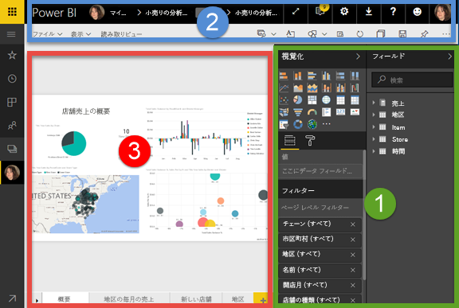
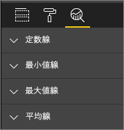

# レポート エディター...紹介を見る
## Power BI サービスおよび Power BI Desktop でのレポートの編集
Power BI サービスのレポート エディターと Power BI Desktop のレポート エディターは、よく似ています。 ビデオでは Power BI Desktop のレポート エディターを、この記事では Power BI サービスのレポート エディターを説明します。 

## レポート*作成者*とレポート *コンシューマー*の違い
レポートを作成し編集できるのは、レポートの所有者 (別名 "*作成者*") に限られます。 共有されたレポートを "*使用*" している場合、[読み取りビューでのみ](consumer/end-user-reading-view.md) Power BI サービス内のレポートを開いて操作できますが、レポートの作成者が利用できるような、信頼性が高く幅広い機能のすべてを利用できるわけではありません。  

レポートの読み取りビューについての詳細は、[Power BI サービスの読み取りビューと編集ビュー](consumer/end-user-reading-view.md)に関するページをご覧ください。 

<iframe width="560" height="315" src="https://www.youtube.com/embed/IkJda4O7oGs" frameborder="0" allowfullscreen></iframe>

Power BI サービスでは、*レポート エディター*は[編集ビュー](consumer/end-user-reading-view.md)でのみ使用できます。 編集ビューでレポートを開くには、レポートの所有者、つまり作成者である必要があります。

Power BI レポート エディターは、3 つのセクションで構成されています。  

1. **フィールド**、**視覚化**、**フィルター**の各ウィンドウ
2. 上部のナビゲーション バー    
3. レポート キャンバス     

## 1.レポート エディターのウィンドウ

レポートを開くと、最初に視覚化、フィルター、フィールドという 3 つのウィンドウが表示されます。 左側にある視覚化ウィンドウとフィルター ウィンドウは、視覚化がどのように表示されるか (種類、色、フィルター、書式) を制御します。  右側にあるフィールド ウィンドウは、視覚化の際に使用される基になるデータを管理します。 

レポート エディターに表示されるコンテンツは、レポート キャンバスで選択した内容によって異なります。  たとえば、個々のビジュアルを選択すると、 

|  |  |
| --- | --- |
|  |<ul><li>視覚化ウィンドウの上部に、使用中のビジュアルの種類が識別されます。この例では、集合縦棒グラフです。  </li> <li>視覚化ウィンドウの下部に、ビジュアルに使用されているフィールドが表示されます (表示されない場合、下にスクロールしてください)。 このグラフでは FiscalMonth、DistrictManager、Total Sales Variance が使用されています。   </li><li>フィルター ウィンドウには、適用されているすべてのフィルターが表示されます (表示されない場合、下にスクロールしてください)。   </li><li>フィールド ウィンドウには、使用可能なテーブルが表示されます。テーブル名を展開すると、そのテーブルを構成しているフィールドが表示されます。 黄色のフォントは、そのテーブルの少なくとも 1 つのフィールドが視覚エフェクトで使用されていることを示します。  </li><li> 選択した視覚化の書式ウィンドウを表示するには、ペイント ローラーのアイコンを選択します。  </li><li> 分析ウィンドウを表示するには、拡大鏡アイコンを選択します。</ul> |

## 視覚化ウィンドウ (上から下)
![[視覚化] ウィンドウの上部](media/service-the-report-editor-take-a-tour/selectviz.png)

ここで視覚化の種類を選択します。 小さい画像は*テンプレート*と呼ばれます。 上の画像では集合縦棒グラフが選択されています。 最初に視覚化の種類を選択しないで、フィールドを選択して視覚化の作成を始めた場合、Power BI によって視覚化の種類が自動的に選択されます。 Power BI による選択をそのまま使用することも、別のテンプレートを選んで種類を変更することもできます。 必要なだけ何度でも種類を切り替えて、データを最も的確に表現できる視覚化の種類を見つけてください。

### ビジュアルで使用されているフィールドを管理する。
![[視覚化] ウィンドウの中央部](media/service-the-report-editor-take-a-tour/power-bi-field-list.png)

このウィンドウに表示されるバケット (*ウェル*と呼ばれることもあります) は、どの種類の視覚化を選択したかによって異なります。  たとえば、横棒グラフを選択した場合は、値、軸、および凡例のバケットが表示されます。 フィールドを選択するか、または、キャンバス上にドラッグすると、Power BI はバケットのいずれかにそのフィールドを追加します。  フィールドの一覧からバケットにフィールドを直接ドラッグすることもできます。  いくつかのバケットは、特定の種類のデータにしか使用できません。  たとえば、 **値** は数値以外のフィールドを受け付けません。 つまり、 **employeename** フィールドを **値** バケットにドラッグすると、Power BI によって **employeename の数**に変更されます。

### フィールドの削除
視覚化からフィールドを削除するには、フィールド名の右にある **[X]** を選択します。

詳細については、「[Power BI レポートへの視覚化の追加](visuals/power-bi-report-add-visualizations-i.md)」を参照してください。

### ビジュアルの書式設定
ペイント ローラー アイコンを選択して書式ウィンドウを表示します。 使用可能なオプションは、選んだ視覚化の種類によって異なります。

書式設定の可能性は、ほぼ無限です。  詳しくは、実際に使ってみるか、次の記事を参照してください。

* [視覚化タイトル、背景、および凡例のカスタマイズ](visuals/power-bi-visualization-customize-title-background-and-legend.md)
* [色の書式設定](visuals/service-getting-started-with-color-formatting-and-axis-properties.md)
* [X 軸と Y 軸のプロパティのカスタマイズ](visuals/power-bi-visualization-customize-x-axis-and-y-axis.md)

### 視覚化に分析を追加する
拡大鏡アイコンを選択して分析ウィンドウを表示します。 使用可能なオプションは、選んだ視覚化の種類によって異なります。

    
Power BI サービスの分析ウィンドウでは、視覚化に動的な基準線を追加し、重要な傾向や洞察にフォーカスを設定できます。 詳細については、「[Power BI サービスの [分析] ウィンドウ](service-analytics-pane.md)」または「[Power BI Desktop の [分析] ウィンドウ](desktop-analytics-pane.md)」を参照してください。

- - -
## フィルター ウィンドウ
フィルター ウィンドウを使うと、ページ、レポート、ドリルスルーおよびビジュアルの各レベルでレポートの固定フィルターの閲覧、設定、変更ができます。 そうです。ビジュアルの要素を選ぶか、スライサーのようなツールを使うと、レポート ページとビジュアルに対してアドホック フィルター処理ができますが、フィルター ウィンドウを使うと、フィルターの状態はレポートとともに保存されます。 

フィルター ウィンドウにはもう 1 つ強力な機能があります。それは***レポート内のビジュアルでまだ使われていない***フィールドを使ったフィルター処理の機能です。 説明しましょう。 レポート ページを作成するときに、Power BI は視覚エフェクトで使用しているすべてのフィールドを、フィルター ウィンドウのビジュアル レベル フィルター領域に自動的に追加します。  ただし、視覚エフェクトで現在使用されていないフィールドを使うビジュアル フィルター、ページ フィルター、ドリルスルー フィルター、レポート フィルターを設定する場合は、フィルター バケットの 1 つにそれをドラッグします。   

詳細については、「[レポートへのフィルターの追加](power-bi-report-add-filter.md)」を参照してください。

- - -
## フィールド ウィンドウ
フィールド ウィンドウには、データ内に存在するテーブルとフィールドが表示されます。これらのテーブルとフィールドを使用して、視覚化を作成できます。

|  |  |
| --- | --- |
|  |<ul><li>ページにフィールドをドラッグして、新しい視覚化を作成します。  既存の視覚化にフィールドをドラッグし、その視覚化にフィールドを追加することもできます。  </li> <li>フィールドの横にチェックマークを追加すると、そのフィールドがアクティブな (または新しい) 視覚化に追加されます。 また、そのフィールドをどのバケットに配置するかも決定されます。  たとえば、フィールドを凡例、軸、値のいずれに使用するかについて決定されます。 Power BI で最良の判断が行われますが、配置されたフィールドを必要に応じて別のバケットに移動できます。   </li><li>どちらの方法でも、選択された各フィールドは、レポート エディターの視覚化ウィンドウに追加されます。</li></ul> |

**注**: Power BI Desktop を使用している場合は、フィールドの表示/非表示、計算の追加などのオプションも使用できます。

### フィールドのアイコンの意味
* **∑ 集計** 集計とは、合計や平均などが計算される数値です。 集計は、データと一緒にインポートされます (レポートの基となるデータ モデルで定義されます)。
  詳細については、「[Power BI レポートの集計](service-aggregates.md)」を参照してください。
*  **計算メジャー (計算フィールドとも呼ばれています)**  
   それぞれの計算フィールドには、独自のハードコーディングされた式があります。 計算を変更することはできません、たとえば、合計であれば、合計のままにしかできません。 詳細については、「[メジャーについて](desktop-measures.md)」を参照してください。
*  **一意フィールド**  
   このアイコンのフィールドは、Excel からインポートされ、重複するものがあっても、すべての値が表示されるように設定されています。 たとえば、データに 'John Smith' という名前のユーザーのためのレコードが 2 つあったとしても、それぞれが一意として扱われ、合計が計算されることはありません。  
* **geography フィールド**  
   地図の視覚化を作成するために使用できる場所フィールドです。 
* **階層**  
   方向キーを選択し、階層を構成するフィールドを表示します。 

- - -
## 2.上部のナビゲーション バー
上部のナビゲーション バーからさまざまな操作を実行できます。新しい操作が常時追加されています。 特定の操作については、Power BI ドキュメントの目次や検索ボックスを使用してください。

## 3.レポート キャンバス
レポート キャンバスは、作業内容が表示される場所です。 フィールド、フィルター、視覚化のウィンドウを使用してビジュアルを作成すると、ビジュアルはレポート キャンバスで構築され、表示されます。 キャンバスの下部にあるタブは、それぞれレポートのページを表します。 タブを選択すると、そのページが開きます。 

## 次の手順:
[レポートの作成](service-report-create-new.md)

[Power BI サービス](consumer/end-user-reports.md)、[Power BI Desktop](desktop-report-view.md)、[Power BI Mobile](consumer/mobile/mobile-apps-view-phone-report.md) の各レポートについての詳細をご覧ください。

[Power BI - 基本的な概念](consumer/end-user-basic-concepts.md)

他にわからないことがある場合は、 [Power BI コミュニティを利用してください](http://community.powerbi.com/)。

