# チュートリアル: Power BI で GitHub サンプルに接続する
このチュートリアルでは、Power BI で GitHub サービスの実際のデータに接続します。Power BI でダッシュボードとレポートが自動的に作成されます。 Power BI のコンテンツ パブリック リポジトリ (単に "*リポジトリ*" とも呼ばれます) に接続すると、さまざまな情報が表示されます。たとえば、Power BI のパブリック コンテンツに寄稿しているユーザーの数のほか、 最も寄稿が多いユーザーは誰か、 最も寄稿が多いのは何曜日か、 などといった疑問に対する答えがわかります。 

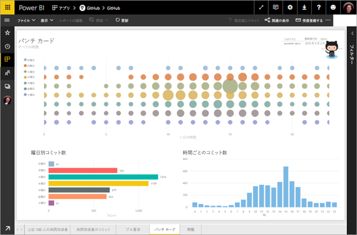

このチュートリアルでは、以下の手順を実行します。

> [!div class="checklist"]
> * まだ持っていない場合は、GitHub アカウントにサインアップします 
> * Power BI アカウントにサインインするか、まだ行っていない場合はサインアップします
> * Power BI サービスを開きます
> * GitHub アプリを検索します
> * Power BI のパブリック GitHub リポジトリに関する情報を入力します
> * GitHub データでダッシュボードとレポートを表示します
> * アプリを削除することによってリソースをクリーンアップします

Power BI にサインアップしていない場合は、[無料の試用版にサインアップ](https://app.powerbi.com/signupredirect?pbi_source=web)してください。

## 前提条件

GitHub アカウントをまだ持っていない場合、このチュートリアルを行うにはアカウントが必要です。 

- [GitHub アカウント](https://docs.microsoft.com/contribute/get-started-setup-github)にサインアップする

## 接続する方法
1. Power BI サービスにサインインします (http://powerbi.com)。 
2. 左側のナビゲーション ウィンドウで **[アプリ]** を選んでから、**[アプリの取得]** を選びます。
   
   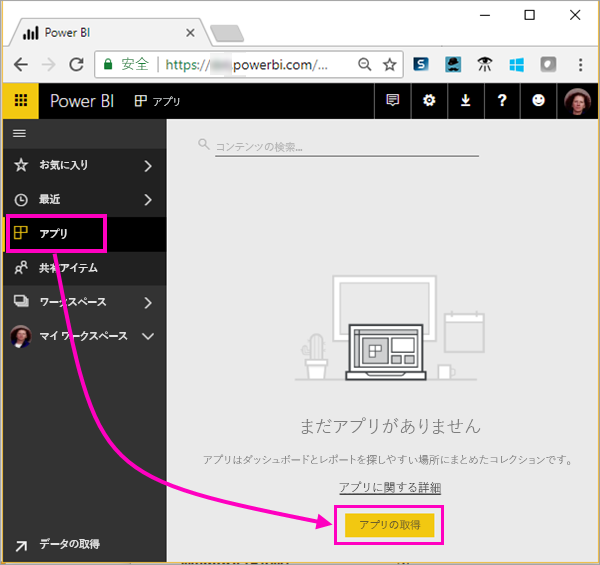 

3. **[アプリ]** を選び、検索ボックスに「**github**」と入力して、**[今すぐ入手する]** を選びます。
   
   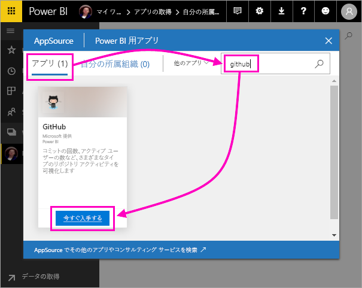 

4. リポジトリの名前とリポジトリの所有者を入力します。 このリポジトリの URL は https://github.com/MicrosoftDocs/powerbi-docs なので、**[リポジトリ所有者]** は「**MicrosoftDocs**」、**[リポジトリ]** は「**powerbi-docs**」です。 
   
    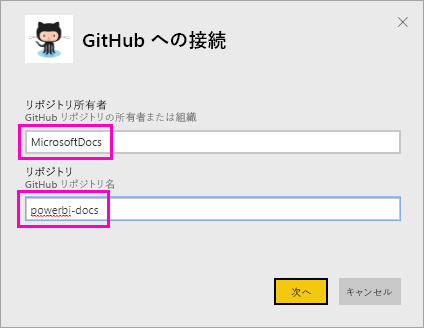

5. 作成した GitHub の資格情報を入力します。 お使いのブラウザーで GitHub に既にサインインしている場合、Power BI はこのステップを省略することがあります。 

6. **[認証方法]** として **[oAuth2]** \> **[サインイン]** の順に選びます。

7. Github の認証画面に従ってください。 GitHub データへのアクセス許可を Power BI に付与します。
   
   Power BI は GitHub とそのデータに接続できるようになります。  データは、1 日に 1 回更新されます。

8. Power BI がデータをインポートすると、新しい GitHub タイルが表示されます。 
 
   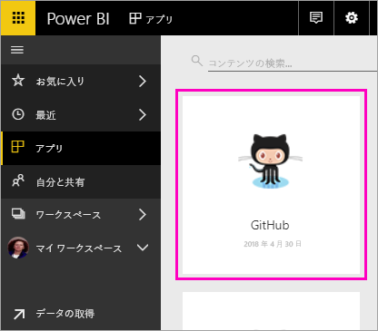 

8. グローバル ナビゲーション アイコンを選んで左側のナビゲーションを最小化し、表示領域を大きくします。

    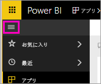

10. ステップ 8 の GitHub タイルを選びます。 
    
    GitHub ダッシュボードが開きます。 これはライブ データなので、表示される値は異なる場合があります。

    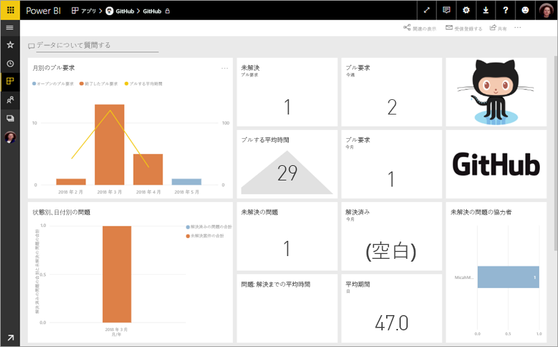

    

## 質問する

11. **[データについて質問する]** にカーソルを置き、**[pull requests]** を選びます。 

    ![Power BI の [データについて質問する]](media/service-tutorial-connect-to-github/power-bi-github-app-tutorial-ask-question.png)

12. 「**by month**」と入力します。
 
    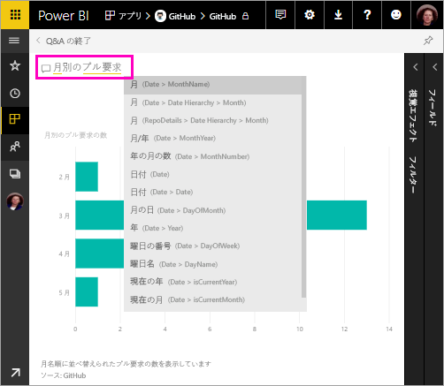

     Power BI は、月別のプル要求の数を示す横棒グラフを作成します。

13. **[Q&A の終了]** を選びます。

## GitHub のレポートを表示する 

1. GitHub ダッシュボードで、縦棒と折れ線の複合グラフ **Pull Requests by Month** を選んで、関連するレポートを開きます。

    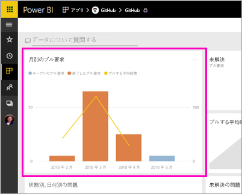

2. **Total pull requests by user** グラフでユーザー名を選ぶと、この例のように、3 月は合計平均より平均時間が多かったことがわかります。

    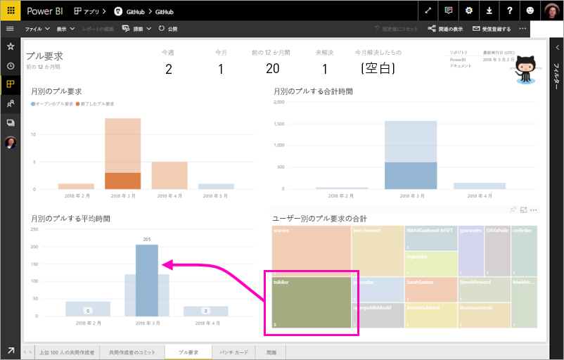

3. **[Punch Card]** タブを選び、レポートで次のページを表示します。 
 
    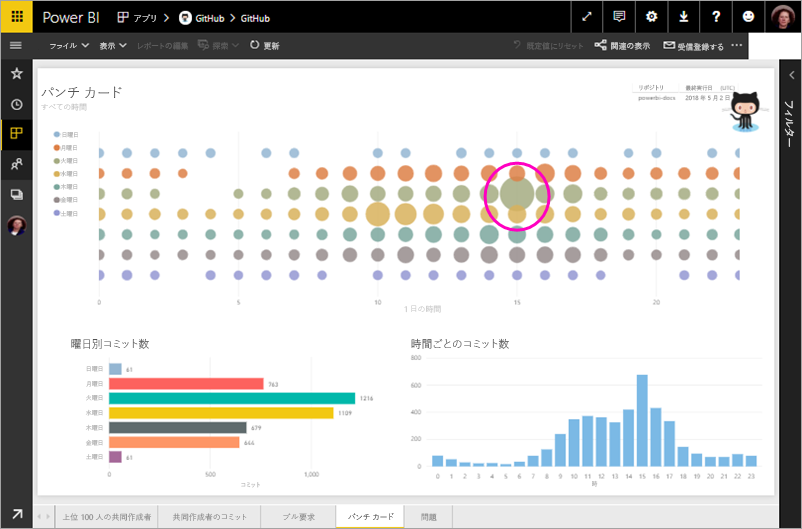

    明らかに、ユーザーが作業をチェックインする "*コミット*" が最も多いのは、火曜日の午後 3 時です。

## リソースをクリーンアップする

チュートリアルはこれで終わりなので、GitHub アプリを削除できます。 

1. 左側のナビゲーション バーで **[アプリ]** を選びます。
2. GitHub のタイルをポイントし、**[削除]** ごみ箱を選びます。

    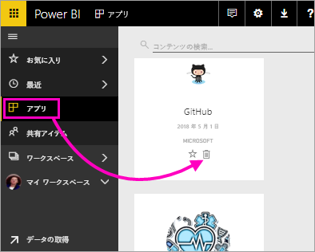

## 次の手順

このチュートリアルでは、GitHub のパブリック リポジトリに接続し、データを取得しました。データは、Power BI のダッシュボードとレポートで書式設定されました。 ダッシュボードとレポートを調べることにより、データに関するいくつかの質問に対する答えを得ました。 これで、Salesforce、Microsoft Dynamics、Google Analytics など、他のサービスへの接続についてさらに学習できます。 
 
> [!div class="nextstepaction"]
> [使用するオンライン サービスに接続する](./service-connect-to-services.md)

