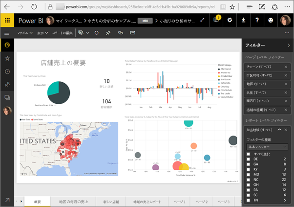
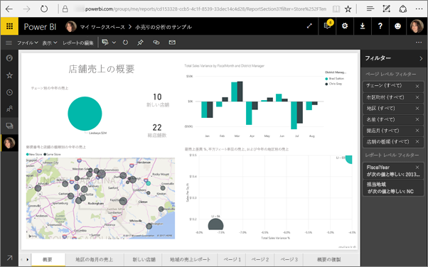

# <a name="filter-a-report-using-query-string-parameters-in-the-url"></a>URL のクエリ文字列パラメーターを使用してレポートをフィルター処理する
Power BI サービスでレポートを開くと、レポートの各ページに一意の URL があります。 そのレポート ページをフィルター処理するには、レポート キャンバスの [フィルター] ウィンドウを使うことができます。  または、クエリ文字列パラメーターを URL に追加して、レポートをフィルター処理できます。 同僚に見せるレポートに事前にフィルターを適用したい場合、 1 つの方法は、レポートの既定の URL にフィルター パラメーターを追加し、URL 全体をメールで同僚に送るというものです。



<iframe width="640" height="360" src="https://www.youtube.com/embed/WQFtN8nvM4A?list=PLv2BtOtLblH3YE_Ycas5B1GtcoFfJXavO&amp;showinfo=0" frameborder="0" allowfullscreen></iframe>

## <a name="query-string-parameter-syntax-for-filtering"></a>フィルター処理のためのクエリ文字列パラメーターの構文
構文はとても簡単です。レポートの URL に疑問符を追加し、その後にフィルター構文を追加します。

URL?filter=***<テーブル>***/***<フィールド>*** eq '***<値>***'


* **テーブル**と**フィールド**の名前では大文字と小文字が区別され、**値**では区別されません。
* レポート ビューに表示されないフィールドをフィルター処理することもできます。
* **値**は一重引用符で囲む必要があります。
* フィールドの型は、数値または文字列にする必要があります。
* テーブルおよびフィールドの名前にスペースが含まれていてはなりません。

以下では構文についてさらに詳しく説明します。  

## <a name="filter-on-a-field"></a>フィールドをフィルター処理する
次のようなレポートの URL があるものとします。


そして、ノースカロライナ州の店舗に関するマップの視覚化 (上図) を表示します。

>[!NOTE]
>この例は、[Retail Analysis サンプル](sample-datasets.md)が基になっています。
> 

"NC" (ノースカロライナ) の店舗のデータだけが表示されるようにレポートをフィルター処理するには、URL に以下を追加します。

?filter=Store/Territory eq 'NC'


>[!NOTE]
>*NC* は、**Store** テーブルの **Territory** フィールドに格納されている値です。
> 
> 

レポートはノースカロライナでフィルター処理されます。レポート ページのすべての視覚化には、ノースカロライナのデータだけが表示されます。



## <a name="filter-on-multiple-fields"></a>複数のフィールドでフィルター処理する
URL にパラメーターを追加し、複数のフィールドでフィルター処理することもできます。 元のフィルター パラメーターに戻りましょう。

```
?filter=Store/Territory eq 'NC'
```

追加フィールドにフィルターを適用するには、上記と同じ形式で `and` と別のフィールドを追加します。 次に例を示します。

```
?filter=Store/Territory eq 'NC' and Store/Chain eq 'Fashions Direct'
```

<iframe width="640" height="360" src="https://www.youtube.com/embed/0sDGKxOaC8w?showinfo=0" frameborder="0" allowfullscreen></iframe>


### <a name="using-dax-to-filter-on-multiple-values"></a>DAX を使用して複数の値にフィルターを適用するには
複数のフィールドにフィルターを適用するもう 1 つの方法は、2 つのフィールドを 1 つの値に連結する計算列を作成することです。 その後は、その値に対してフィルターを適用できます。

たとえば、この例には Territory と Chain という 2 つのフィールドがあります。 Power BI Desktop で、TerritoryChain という名前の[新しい計算列 (フィールド) を作成](desktop-tutorial-create-calculated-columns.md)します。 **フィールド**名にスペースが含まれてはならないことに注意してください。 その列に DAX 式は次のようになります。

TerritoryChain = [Territory] & " - " & [Chain]

レポートを Power BI サービスに公開した後、URL クエリ文字列を使って、NC の Lindseys 店のデータだけを表示するようにフィルター処理します。

    https://app.powerbi.com/groups/me/reports/8d6e300b-696f-498e-b611-41ae03366851/ReportSection3?filter=Store/TerritoryChain eq 'NC–Lindseys'

## <a name="pin-a-tile-from-a-filtered-report"></a>フィルター処理されたレポートのタイルをピン留めする
クエリ文字列パラメーターを使ってレポートをフィルター処理した後は、そのレポートの視覚化をダッシュボードにピン留めできます。 ダッシュボードのタイルにはフィルター処理されたデータが表示され、そのダッシュボードのタイルを選ぶと、タイルの作成に使われたレポートが表示されます。  ただし、URL を使って行ったフィルター処理はレポートと共には保存されず、ダッシュボードのタイルを選ぶと、フィルター処理されていない状態のレポートが開きます。  つまり、ダッシュボードのタイルに表示されたデータは、レポートの視覚化に表示されるデータと一致しません。

これは、フィルター処理されたダッシュボードとフィルター処理されていないレポートで異なる結果を見たい場合に、役立つことがあります。

## <a name="considerations-and-troubleshooting"></a>考慮事項とトラブルシューティング
クエリ文字列パラメーターを使う場合に注意すべき点が 2 つあります。

* Power BI Report Server で、レポートの URL に含ませることによって[レポート パラメーターを渡す](https://docs.microsoft.com/sql/reporting-services/pass-a-report-parameter-within-a-url?view=sql-server-2017.md)ことができます。 レポート処理エンジンに直接渡されるため、これらの URL パラメーターにはプレフィックスが付いていません。 
* クエリ文字列のフィルター処理は、[[Web に公開]](service-publish-to-web.md) または Power BI Embedded では機能しません。   
* フィールドの型は、数値または文字列にする必要があります。
* テーブルおよびフィールドの名前にスペースが含まれていてはなりません。

## <a name="next-steps"></a>次の手順
[視覚化をダッシュボードにピン留めする](service-dashboard-pin-tile-from-report.md)  
[無料試用版にサインアップ](https://powerbi.microsoft.com/get-started/)

他にわからないことがある場合は、 [Power BI コミュニティで質問してみてください](http://community.powerbi.com/)。

