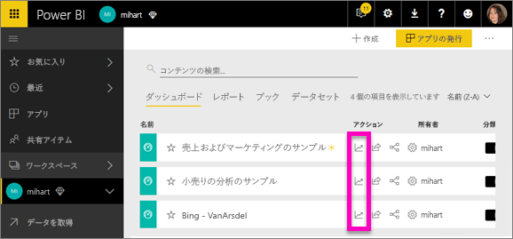
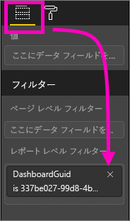
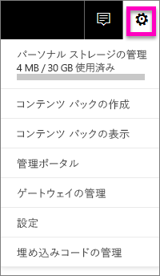
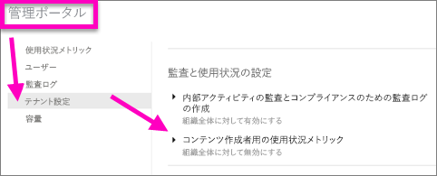
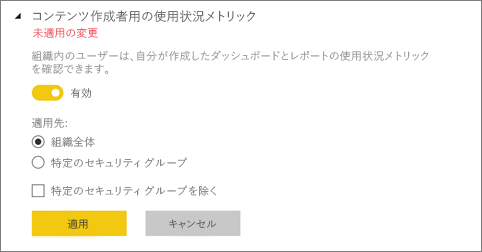

# ダッシュボードとレポートの利用状況の指標
ダッシュボードとレポートを作成した場合、その効果を理解するために利用状況の指標が役立ちます。 ダッシュボード利用状況指標またはレポート利用状況指標を実行すると、そのダッシュボードやレポートが組織全体でどのように利用されているか、何が利用されているか、だれに利用されているか、何の目的で利用されているかわかります。  

> [!NOTE]
> 利用状況指標は、SharePoint Online に埋め込まれているレポートの利用状況を追跡記録します。 ただし、利用状況のメトリックでは、"ユーザー所有資格情報" と "アプリ所有資格情報" フローの両方を介したダッシュボードとレポートの埋め込みは追跡記録されません。 利用状況の指標は、[Web に公開](service-publish-to-web.md)を介して埋め込まれるレポートの利用状況も追跡記録しません。

このような利用状況指標レポートは読み取り専用です。 ただし、"名前を付けて保存" を利用し、利用状況指標レポートを自分用にカスタマイズできます。 それによりまったく新しいデータセットが作成され、読み取り専用レポートがすべての機能を備えた、編集可能な Power BI レポートに変換されます。 個人用にカスタマイズしたレポートに選択したダッシュボードまたはレポートの指標が含まれるだけでなく、既定のフィルターを削除することで、選択したワークスペースのあらゆるダッシュボードまたはレポートの利用状況指標にアクセスできるようになりました。 また、エンド ユーザーの名前までも確認できます。

## 利用状況の指標が重要となる理由
コンテンツの利用状況を知ることで、効果を証明し、労力に優先順を付けることができます。 利用状況の指標からは、たとえば、組織の大部分がレポートの 1 つを毎日利用しており、作成したダッシュボードがまったく閲覧されていないことなどがわかります。 このような情報は、仕事に労力を正しく使う上で非常に重要です。

利用状況指標レポートは Power BI サービスだけで実行できます。  しかしながら、利用状況指標レポートを保存するか、ダッシュボードにピン留めすると、モバイル デバイスでそのレポートを開き、操作できます。

### 前提条件
- 利用状況の指標機能は、割り当てられているライセンスに関係なく、すべてのユーザーの利用状況情報を取得します。 ただし、利用状況の指標データにアクセスし、実行するには、Power BI Pro ライセンスが必要です。
- 選択したワークスペースのダッシュボードまたはレポートについて、利用状況指標が提供されます。 特定のダッシュボードまたはレポートの利用状況の指標にアクセスするには、次のものが必要です。    
    • そのダッシュボードまたはレポートへの編集アクセス許可   
    • Pro ライセンス

## 利用状況の指標レポートについて

**[利用状況の指標]** またはアイコン  を選択すると、Power BI によって過去 90 日間のそのコンテンツの利用状況の指標が含まれる事前に作成されたレポートが生成されます。  このレポートは、使い慣れている Power BI レポートと似ていますが、そのデザインは対話形式でなく、情報提供を目的としています。 アクセス手段 (Web やモバイル アプリなど) に関係なく、エンド ユーザーがアクセスを受け取った方法に基づいてスライスできます。ダッシュボードやレポートが変わると利用状況指標レポートも変わります。新しいデータで毎日更新されます。  

利用状況の指標レポートは、**[最近]**、**[ワークスペース]**、**[お気に入り]**、その他のコンテンツ一覧には表示されません。 アプリに追加できません。 利用状況指標レポートからダッシュボードにタイルを固定すると、そのダッシュボードはアプリやコンテンツ パックに追加できません。

レポート データを掘り下げて調べたり、データセットに対して独自のレポートを構築したりするには、**[名前を付けて保存]** を利用します (「[利用状況の指標レポートをフル機能の Power BI レポートとして保存する](#Save-the-Usage-Metrics-report-as-a-full-featured-Power-BI-report-(personalize))」を参照してください)。

## ダッシュボードまたはレポートの利用状況の指標レポートを開く
1. ダッシュボードまたはレポートを含んでいるワークスペースで起動します。
2. ワークスペース コンテンツの一覧から、またはダッシュボードまたはレポート自体から、**[利用状況の指標]** アイコン  を選択します。

    

    
3. これを初めて実行すると、Power BI によって利用状況指標レポートが作成され、準備できると知らされます。

        
4. 結果を開くには、**[使用状況メトリックの表示]** を選択します。

    Power BI のダッシュボードやレポートを展開したり、保守管理したりするとき、利用状況指標は強力なツールとなります。 レポートの中で最も役に立つページはどれか、削除するべきページはどれかわかりますか。 **レポート ページ**別にスライスすると見つかります。ダッシュボードにモバイル レイアウトを構築するかどうか迷っていますか。 **プラットフォーム**でスライスすると、モバイル アプリまた Web ブラウザーを使ってコンテンツにアクセスしているユーザーの数がわかります。

5. 必要であれば、視覚エフェクトをポイントしてピン アイコンを選び、ダッシュボードに視覚エフェクトを追加します。 または、上部のメニュー バーから **[ライブ ページをピン留めする]** を選び、ページ全体をダッシュボードに追加します。 ダッシュボードからは、さらに簡単に利用状況の指標を監視したり、他のユーザーと共有したりできます。

    > [!NOTE]
    > 利用状況指標レポートからダッシュボードにタイルを固定すると、そのダッシュボードはアプリやコンテンツ パックに追加できません。

## どのような指標が報告されるでしょうか。

| 指標 | ダッシュボード | レポート | 説明 |
| --- | --- | --- | --- |
| Distribution method slicer (配布メソッド スライサー) |はい |はい |どのようにユーザーがコンテンツにアクセスしたか。 3 つの使用可能な方法があります。ユーザーは[アプリ ワークスペース](service-the-new-power-bi-experience.md)のメンバーになることによって、コンテンツを[共有する](service-share-dashboards.md)ことによって、またはコンテンツ パック/アプリをインストールすることによって、ダッシュボードまたはレポートにアクセスすることができます。  アプリを介した表示は、"コンテンツ パック" としてカウントされます。 |
| Platforms slicer (プラットフォーム スライサー) |はい |はい |ダッシュボードまたはレポートに Power BI サービス (powerbi.com) またはモバイル デバイスを使用してアクセスしましたか。 モバイルには、すべての iOS、Android、および Windows アプリが含まれています。 |
| レポート ページ スライサー |いいえ |はい |レポートに複数のページがある場合、表示したページごとにレポートをスライスします。 "Blank (空)" にリスト オプションが表示された場合、レポート ページが最近追加されたか (24 時間以内に新しいページの実際の名前がスライサー リストに表示されます)、削除されています。 "Blank" とはそのような状況を表現します。 |
| Views per day (1 日あたりの表示) |はい |はい |1 日の表示の合計数 ‐ 表示はユーザーによるレポート ページまたはダッシュボードの読み込みとして定義されます。 |
| Unique viewers per day (1 日あたりの固有の表示) |はい |はい |ダッシュボードまたはレポートを表示した*異なる*ユーザーの数 (AAD ユーザー アカウントに基づく)。 |
| Views per user (ユーザーあたりの表示) |はい |はい |過去 90 日間の表示数をユーザー別に分類したもの。 |
| 1 日あたりの共有 |はい |いいえ |ダッシュボードが別のユーザーまたはグループと共有された回数。 |
| Total views (総表示数) |はい |はい |過去 90 日間の表示の数。 |
| Total viewers (閲覧者合計) |はい |はい |過去 90 日間の固有の閲覧者の数。 |
| Total shares (合計共有数) |はい |いいえ |過去 90 日以内にダッシュボードまたはレポートが共有された回数。 |
| Total in organization (組織内の合計) |はい |はい |過去 90 日間、組織全体で少なくとも 1 回表示されたすべてのダッシュボードまたはレポートの数。  順位付けの計算に使用します。 |
| Rank: Total views (ランク: 総表示数) |はい |はい |過去 90 日間の組織内のすべてのダッシュボードまたはレポートの合計表示回数。これにより、このダッシュボードまたはレポートがランク付けされます。 |
| Rank: Total shares (ランク: 合計共有数) |はい |いいえ |過去 90 日間の組織内のすべてのダッシュボードの合計共有回数。これにより、このダッシュボードまたはレポートがランク付けされます。 |

### ダッシュボードの利用状況の指標レポート

### レポートの利用状況の指標レポート

## 利用状況の指標レポートをフル機能の Power BI レポートとして保存する (カスタマイズ)

**[名前を付けて保存]** を使用して、利用状況の指標レポートをカスタマイズおよび共有できるフル機能の Power BI レポートに変換します。 個人用に設定したコピーを作成した後は、基になるデータセットに完全にアクセスし、特定のニーズに合わせて利用状況の指標レポートをカスタマイズできます。 Power BI Desktop を利用し、[Power BI サービス機能にライブ接続し](https://powerbi.microsoft.com/blog/connecting-to-datasets-in-the-power-bi-service-from-desktop)、利用状況指標レポートをカスタマイズすることもできます。

また、基礎データセットには、ワークスペースのすべてのダッシュボードまたはレポートの利用状況詳細が含まれます。 これにより、別の可能性が広がります。 たとえば、利用状況に基づき、ワークスペースのすべてのダッシュボードを比較するレポートを作成できます。 あるいは、自分の Power BI アプリに利用状況指標ダッシュボードを作成できます。そのアプリ内で配信されているすべてのコンテンツを対象に利用状況を集計します。  下の[ページ レベル フィルターの削除](#remove-the-filter-to-see-all-the-usage-metrics-data-in-the-workspace)に関する項を参照してください。

### "名前を付けて保存" で何が作成されるのか
Power BI でフル機能のレポートを作成すると、過去 90 日間でアクセスされた、**現在のワークスペースに含まれるすべてのダッシュボードまたはすべてのレポートから構成される**データセットも新規作成されます。 たとえば、"Sales" という名前のワークスペースに 3 つのダッシュボードと 2 つのレポートが含まれるとき、"Northeast" というダッシュボードで利用状況指標レポートを作成するとします。 次に、**[名前を付けて保存]** を利用し、カスタマイズしてフル機能レポートに変換します。 その新しいレポートのデータセットには、*"Northeast" という名前の 1 つのダッシュボードだけでなく*、"Sales" ワークスペースの 3 つすべてのダッシュボードの利用状況指標が含まれます。 既定では、レポートには "Northeast" ダッシュボードのデータが表示されます。3 つすべてのダッシュボードのデータを表示するには、[フィルターを削除する](#remove-the-filter-to-see-all-the-usage-metrics-data-in-the-workspace)必要があります (1 回のクリック)。

### "名前を付けて保存" を利用して利用状況レポートのコピーを作成する
"名前を付けて保存" (カスタマイズ) を利用してコピーを作成すると、既に構築されていた読み取り専用のレポートがフル機能レポートに変換されます。  一見するとまったく同じに見えます。 しかしながら、編集ビューでレポートを開き、新しい視覚効果、フィルター、ページを追加し、既存の視覚効果を変更または削除するなどの操作が可能になります。 Power BI により、新しいレポートとデータセットが現在のワークスペースに保存されます。 次の例では、現在のワークスペースは **mihart** です。

1. 既に構築されていた利用状況指標レポートで、**[ファイル] > [名前を付けて保存]** の順に選択します。 利用状況の指標レポートがフル機能の Power BI レポートに変換されます。 これが*個人に合わせてカスタマイズされた*利用状況指標レポートです。 個人用に設定された利用状況レポートとデータセットは、**mihart* という名前の現在のワークスペースに保存されます。

    
2. 編集ビューでレポートを開き、[他の Power BI レポートと同様に操作します](service-interact-with-a-report-in-editing-view.md)。 たとえば、新しいページの追加、新しい視覚エフェクトの構築、フィルターの追加、フォントや色の書式設定などを行うことができます。

    
3. あるいは、新しいデータセットから始めて、一からレポートを構築します。

    
4. 新しいレポートが現在のワークスペース (mihart) に保存され、**[最近]** コンテンツの一覧にも追加されます。

    ![[レポート] タブ](media/service-usage-metrics/power-bi-new-report.png)

### フィルターを削除し、ワークスペースの***すべての***利用状況指標データを表示する
ワークスペースのすべてのダッシュボードまたはすべてのレポートの指標を表示するには、フィルターを削除する必要があります。 既定では、カスタマイズしたレポートにはフィルターが適用され、その作成に利用されたダッシュボードまたはレポートのみの指標が表示されます。

たとえば、"European sales" という名前のダッシュボードを使用し、レポートを個人用に新しくカスタマイズした場合、"European sales" ダッシュボードの利用状況データのみが表示されます。 フィルターを削除し、そのワークスペースのすべてのダッシュボードのデータを有効にするには:

1. 個人用にカスタマイズしたレポートを編集ビューで開きます。

    ![[レポートの編集] の選択](media/service-usage-metrics/power-bi-editing-view.png)
2. **[フィルター]** ペインで、[レポート レベル フィルター] バケットを見つけ、"x" を選択してフィルターを削除します。

    

    これで、個人用にカスタマイズしたレポートには、ワークスペース全体の指標が表示されます。

## 利用状況指標の管理者制御 - Power BI 管理者の場合
利用状況の指標レポートは、Power BI または Office 365 の管理者が、オンまたはオフにすることができる機能です。 管理者は、使用状況指標にアクセスできるユーザーを細かく制御できます。既定では、組織内のすべてのユーザーに対してオンになっています。

1. Power BI サービスの上部の右にある歯車アイコンを選択し、**[管理ポータル]** を選択します。

    
2. 管理ポータルで、**[テナント設定]** を選択し、**[コンテンツ作成者用の使用状況メトリック]** を選択します。

    
3. 利用状況の指標を有効 (または無効) にして、**[適用]** を選択します。

    

既定では、ユーザーごとのデータは利用状況の指標に対して有効であり、コンテンツ作成者のアカウント情報は指標レポートに含まれます。 一部またはすべてのユーザーに対してこの情報を含めない場合は、指定したセキュリティ グループまたは組織全体に対してこの機能を無効にします。 アカウント情報は、*[名前なし]* としてレポートに表示されます。

組織全体の使用状況指標を無効にすると、管理者は**既存の使用状況指標コンテンツをすべて削除する**オプションを利用し、使用状況指標のレポートとデータセットを利用して構築された既存のレポートとダッシュボード タイルをすべて削除できます。 このオプションで、組織の全ユーザーを対象に、既に利用している場合でも、使用状況指標データの全アクセスが削除されます。 削除した使用状況指標コンテンツは元に戻せないので注意が必要です。

## 考慮事項と制限事項
Q:    ダッシュボードまたはレポートで利用状況指標を実行できません。    
A:    利用状況の指標が表示されるのは、自分が所有するコンテンツか編集アクセス許可が与えられているコンテンツのみです。

Q:    利用状況の指標は、埋め込みのダッシュボードやレポートからビューを取り込みますか。     
A:    現在、利用状況の指標は埋め込まれたダッシュボードとレポートの利用状況の取り込みをサポートしていません。これには、[ユーザー所有データ](developer/integrate-report.md)のフロー、[アプリ所有データ](developer/embed-sample-for-customers.md)のフロー、[Web への公開](service-publish-to-web.md)のフローが含まれます。 これらについては、既存の Web 分析プラットフォームを使って、ホストしているアプリまたはポータルの利用状況を追跡することをお勧めします。

Q:    コンテンツに関係なく利用状況の指標をまったく実行できません。    
A1:    管理者は組織に対してこの機能をオフにすることができます。  管理者に問い合わせ、オフにしていないか確認してください。    
A2:    利用状況の指標は Power BI Pro の機能です。

Q: データは、最新の状態ではないようです。 たとえば、配布方法が表示されない、レポートのページがないなど。   
A: データを更新するには、最大で 24 時間かかります。

Q:    ワークスペースにレポートが 4 つありますが、利用状況指標レポートに 3 とだけ表示されます。    
A:    利用状況指標レポートには、過去 90 日間にアクセスされたレポート (またはダッシュボード) のみが含まれます。  レポート (またはダッシュボード) が表示されない場合、90 日以上使用されていない可能性があります。

## 次の手順
[ダッシュボードをお気に入りにする](service-dashboard-favorite.md)

他にわからないことがある場合は、 [Power BI コミュニティを利用してください](http://community.powerbi.com/)。

